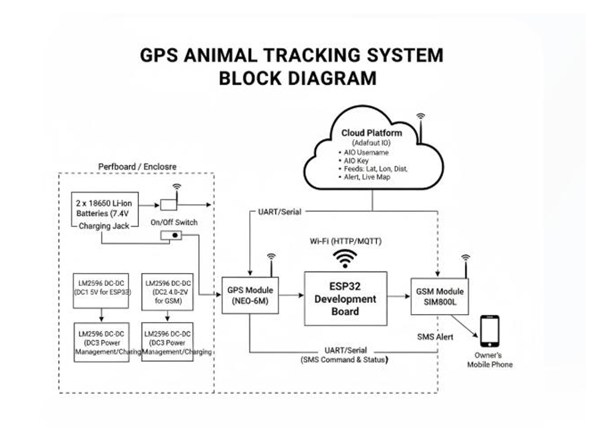
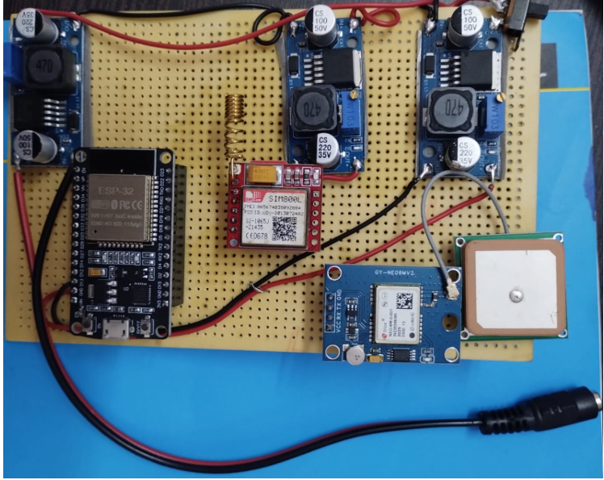
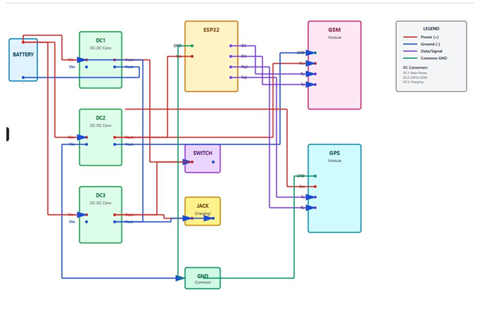
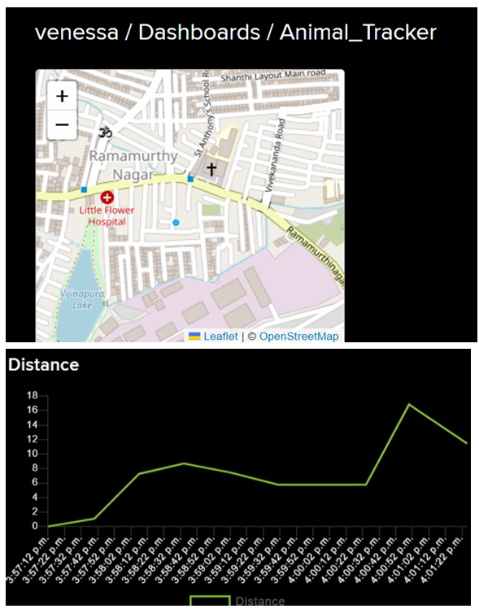
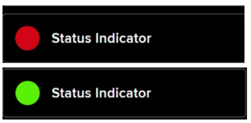
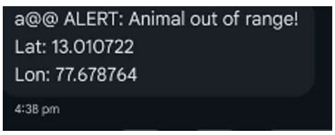

# Wildlife Tracking and Monitoring System (IoT)

An IoT based wildlife tracking system developed using **ESP32, GPS and GSM modules**.  
The system continuously monitors the location of an animal and sends **SMS alerts when the animal moves outside a safe zone**.  
Location data is also uploaded to the **Adafruit IO cloud dashboard** for real-time monitoring.

---

## 📌 Project Overview

Human–wildlife conflict and livestock loss are major problems in many regions.  
This project provides a **low-cost IoT based tracking solution** that allows users to monitor animal movement in real time.

The system:
- Tracks GPS location of the animal
- Calculates distance from a safe location
- Sends alerts when the animal crosses the safe radius
- Uploads data to a cloud dashboard

---

## ⚙️ Hardware Components

- ESP32 Development Board  
- NEO-6M GPS Module  
- SIM800L GSM Module  
- 18650 Li-ion Batteries  
- LM2596 DC-DC Buck Converter  
- Connecting Wires  
- Antenna for GPS and GSM  

---

## 🧠 System Architecture

The system consists of three main layers:

1. **Sensing Layer**
   - GPS module collects latitude and longitude.

2. **Processing Layer**
   - ESP32 processes GPS data.
   - Calculates distance from the home location.

3. **Communication Layer**
   - WiFi uploads data to Adafruit IO.
   - GSM module sends SMS alerts when geofence is violated.

---

## 🔌 Hardware Setup

---

## 🔧 Circuit Diagram

---

## 📊 Adafruit IO Dashboard

The system sends location data to **Adafruit IO cloud** for visualization.

Create an account here:  
https://io.adafruit.com

Create the following feeds:

- latitude
- longitude
- distance
- alert
- location

Dashboard examples:

---

## 🚨 SMS Alert

When the animal moves outside the safe radius, the system sends an SMS alert.

---

## ⚙️ Software Requirements

- Arduino IDE  
- ESP32 Board Package  
- Required Libraries:
  - WiFi.h
  - HTTPClient.h
  - TinyGPSPlus.h

---

## 🚀 Working Principle

1. GPS module sends location data to ESP32.
2. ESP32 calculates distance from the predefined home position.
3. If the distance exceeds the safe radius:
   - Alert status becomes **1**
   - GSM module sends an SMS alert.
4. Location data is uploaded to **Adafruit IO** every 20 seconds.

---

## 👩‍💻 Source Code

The Arduino code for ESP32 is available in:
code/tracker.ino

---

## 📌 Features

- Real-time GPS tracking
- Geofencing based alert system
- SMS notification using GSM
- Cloud monitoring using Adafruit IO
- Low-cost IoT implementation

---

## 🔮 Future Improvements

- Mobile application for monitoring
- Machine learning for animal movement prediction
- LoRa communication for long range tracking
- Solar powered tracking device

---

## 👩‍🎓 Author

Venessa Chrisy.S
RV University – School of Computer Science and Engineering
